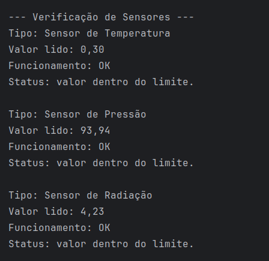
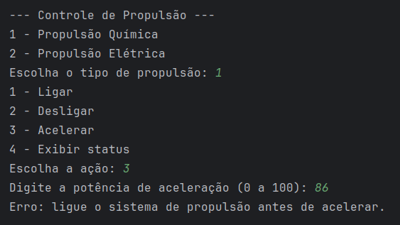
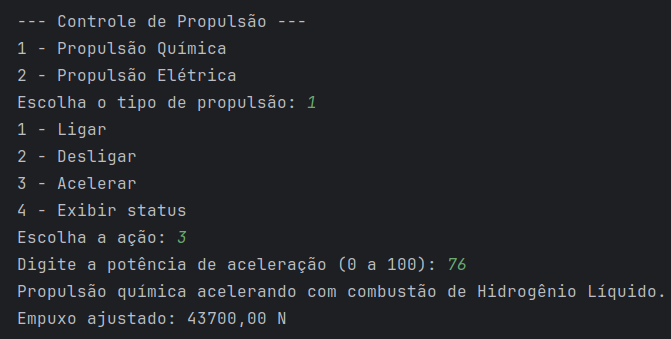
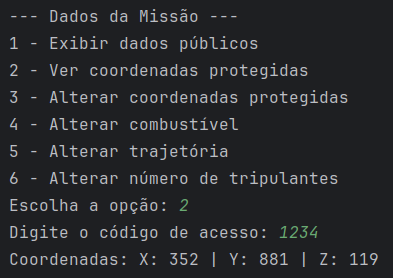
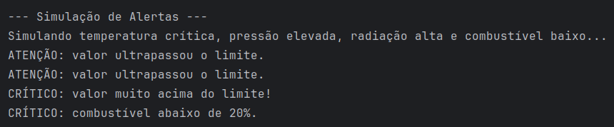
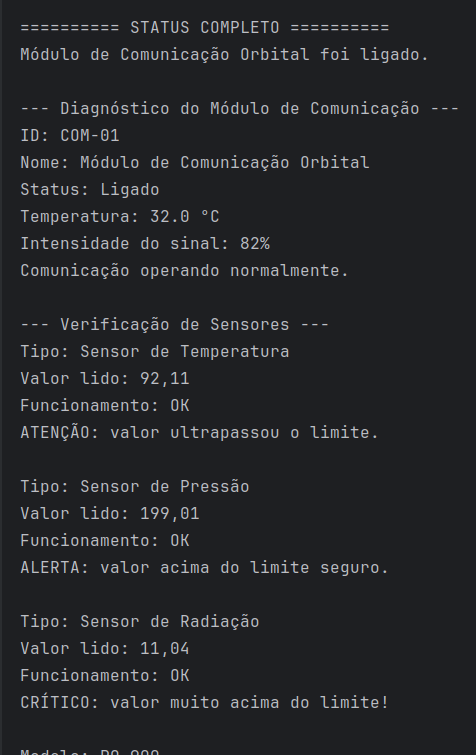

# EcoDart Mission - Plataforma de Monitoramento Espacial

## Integrantes:

- Arthur Reis Batista da Silva | RM 562181
- Carolina Monteiro Bernardo | RM 564651
- Leonardo de Magalhães Piassa | RM 563663

## Descrição do Projeto

O **EcoDart Mission** é uma plataforma desenvolvida em **Java** para simular o monitoramento de sistemas espaciais, aplicando os principais conceitos de **Programação Orientada a Objetos (POO)**.

O sistema permite monitorar sensores, controlar sistemas de propulsão, gerenciar dados da missão e emitir alertas automáticos quando algum valor ultrapassa limites seguros.

Este projeto foi desenvolvido para a **Global Solution 2026 de POO**.

---

## Conceitos de POO Aplicados

O projeto utiliza os seguintes conceitos:

- **Classe abstrata**
- **Interface**
- **Encapsulamento**
- **Herança**
- **Polimorfismo**
- **Sobrescrita de métodos**
- **Organização em pacotes**

---

## Estrutura do Projeto

```text
src/
└── br.com.ecodartmission/
    ├── components/
    │   ├── ComponenteEspacial.java
    │   └── ModuloComunicacao.java
    │
    ├── main/
    │   └── SistemaMonitoramento.java
    │
    ├── missao/
    │   └── DadosMissao.java
    │
    ├── propulsao/
    │   ├── SistemaPropulsao.java
    │   ├── PropulsaoQuimica.java
    │   └── PropulsaoEletrica.java
    │
    └── sensores/
        ├── Sensor.java
        ├── SensorTemperatura.java
        ├── SensorPressao.java
        └── SensorRadiacao.java
```

---

## Pacotes do Projeto

### `br.com.ecodartmission.components`

Contém as classes relacionadas aos componentes espaciais gerais do sistema.

#### Classes

- `ComponenteEspacial`
- `ModuloComunicacao`

A classe `ComponenteEspacial` é uma classe abstrata que serve como base para componentes da missão. Ela possui atributos comuns, como id, nome, status e temperatura.

A classe `ModuloComunicacao` herda de `ComponenteEspacial` e representa um componente concreto do sistema.

---

### `br.com.ecodartmission.sensores`

Contém a interface `Sensor` e suas implementações.

#### Classes

- `Sensor`
- `SensorTemperatura`
- `SensorPressao`
- `SensorRadiacao`

A interface `Sensor` define métodos obrigatórios para todos os sensores, como leitura de valor, verificação de funcionamento e retorno do tipo do sensor.

Cada sensor implementa essa interface e simula leituras diferentes.

---

### `br.com.ecodartmission.propulsao`

Contém as classes responsáveis pelo sistema de propulsão da missão.

#### Classes

- `SistemaPropulsao`
- `PropulsaoQuimica`
- `PropulsaoEletrica`

A classe `SistemaPropulsao` é abstrata e define comportamentos comuns para os sistemas de propulsão, como ligar, desligar e acelerar.

As classes `PropulsaoQuimica` e `PropulsaoEletrica` herdam de `SistemaPropulsao` e implementam comportamentos específicos para cada tipo de propulsão.

---

### `br.com.ecodartmission.missao`

Contém a classe responsável pelos dados protegidos da missão.

#### Classe

- `DadosMissao`

A classe `DadosMissao` aplica encapsulamento, mantendo seus atributos privados e usando getters e setters com validação.

Ela protege informações sensíveis, como coordenadas da missão, utilizando código de acesso.

---

### `br.com.ecodartmission.main`

Contém a classe principal do sistema.

#### Classe

- `SistemaMonitoramento`

A classe `SistemaMonitoramento` possui o método `main` e executa o menu interativo no console.

Por meio dela, o usuário consegue:

- Verificar sensores
- Controlar propulsão
- Gerenciar dados da missão
- Simular alertas
- Exibir o status completo do sistema

---

## Funcionalidades

O sistema possui as seguintes funcionalidades:

- Leitura simulada de sensores
- Verificação de funcionamento dos sensores
- Controle de limites de alerta
- Detecção de valores acima do limite
- Controle de propulsão química e elétrica
- Aceleração com potência de 0% a 100%
- Cálculo de empuxo
- Validação de valores inválidos
- Gerenciamento dos dados da missão
- Proteção de coordenadas por código de acesso
- Alerta automático de combustível abaixo de 20%
- Menu interativo via console
- Sistema de alertas com níveis diferentes

---

## Como Executar o Projeto

### 1. Clone o repositório

```bash
git clone https://github.com/seu-usuario/ecodart-mission.git
```

### 2. Acesse a pasta do projeto

```bash
cd ecodart-mission
```

### 3. Compile os arquivos Java

```bash
javac -d out src/br/com/ecodartmission/**/*.java
```

Caso o comando acima não funcione no seu terminal, compile manualmente assim:

```bash
javac -d out src/br/com/ecodartmission/components/*.java src/br/com/ecodartmission/sensores/*.java src/br/com/ecodartmission/propulsao/*.java src/br/com/ecodartmission/missao/*.java src/br/com/ecodartmission/main/*.java
```

### 4. Execute o sistema

```bash
java -cp out br.com.ecodartmission.main.SistemaMonitoramento
```

---

## Código de Acesso

Para acessar dados protegidos da missão, como coordenadas, utilize o código:

```text
1234
```

---

## Exemplo de Uso

Ao executar o sistema, será exibido um menu parecido com este:

```text
===== SISTEMA DE MONITORAMENTO ESPACIAL =====

1 - Verificar sensores
2 - Controlar propulsão
3 - Gerenciar dados da missão
4 - Simular alertas
5 - Exibir status completo
0 - Sair

Escolha uma opção:
```

O usuário pode escolher as opções pelo terminal e interagir com o sistema.

---

## Relação com os Requisitos da Global Solution

### Classe Abstrata

O projeto possui a classe abstrata `ComponenteEspacial`, que define atributos e métodos comuns para componentes espaciais.

Também possui a classe abstrata `SistemaPropulsao`, usada como base para diferentes tipos de propulsão.

---

### Interface

O projeto possui a interface `Sensor`, implementada por três sensores diferentes:

- `SensorTemperatura`
- `SensorPressao`
- `SensorRadiacao`

---

### Encapsulamento

A classe `DadosMissao` possui atributos privados e métodos de acesso com validações.

Ela também protege dados sensíveis, como coordenadas, usando um código de acesso.

---

### Herança

As classes `PropulsaoQuimica` e `PropulsaoEletrica` herdam de `SistemaPropulsao`.

A classe `ModuloComunicacao` herda de `ComponenteEspacial`.

---

### Sistema de Alertas

O sistema verifica automaticamente valores dos sensores e emite alertas no console quando algum valor ultrapassa o limite definido.

Os alertas podem ser classificados em diferentes níveis, como:

- Atenção
- Alerta
- Crítico

---

## Tecnologias Utilizadas

- Java
- Programação Orientada a Objetos
- Console/Terminal
- IntelliJ IDEA ou Eclipse

## Capturas de Tela







